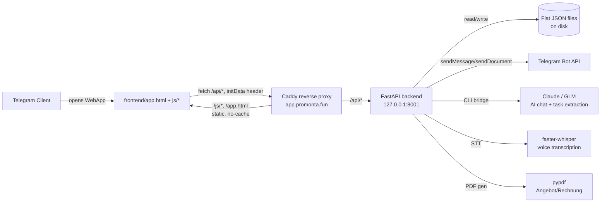

# Architecture

Last verified: 2026-07-23, against production VPS state.

## Overview

There is no database. No ORM. No migrations. Persistence is per-feature JSON files under `/home/promonta/agent/miniapp/` on the VPS, each protected (as of the 2026-07-15 audit) by an atomic-write-plus-per-file-lock pattern (`_atomic_write_json()`, `_lock_for()` in `main.py`) to avoid the JSON-corruption-on-crash class of bug.

## Frontend

- `app.html` — the shell: role-based bottom navigation (two parallel `
` blocks, `#bottom-nav-owner` / `#bottom-nav-worker`, switched by `applyRoleNav()`), view routing (`switchView()`), global CSS.
- `js/*.js` — one file roughly per feature area (home, objects, tasks, chat, checkin, abwesenheit, mangel, tools, profile, onboarding, critical-alerts, worker-checkin-fab, radio, feed, ai, signature, rechnung, angebot, swipe-nav, theme, shared). 01.08: `skill-picker.js` (shared skill-selection component, used by onboarding + profile) and `assignment-sheet.js` (unified assignment flow, replaces the old `bubble-assign.js`) added.
- `angebot-tab.html`, `projects-tab.html`, `tools-tab.html` — standalone legacy tab pages. UNKNOWN whether still linked/used from the current `app.html` shell or superseded by the in-app views — verify before assuming dead code (see FEATURES.md status).
- No bundler, no npm build. Scripts are loaded directly; cache-busting is handled by Caddy's `Cache-Control: no-store, no-cache, must-revalidate` on `/js/*` and `/app.html`, not by filename hashing.
- State management: no framework store. Each JS module manages its own local state and calls `fetch()` directly against `/api/*`.

## Backend

Single file, `main.py` (~146KB, ~93 routes). FastAPI + uvicorn (`uvicorn miniapp.main:app`), run under systemd (`promonta-miniapp.service`), bound to `127.0.0.1:8001` — only reachable via the Caddy reverse proxy, not exposed directly.

### Authentication

No login form, no password, no JWT. Every request must include Telegram WebApp `initData`. Backend validates it via HMAC-SHA256 using `BOT_TOKEN` as key material (`_secret_key()` = `HMAC(b"WebAppData", BOT_TOKEN)`, then `HMAC(secret_key, data_check_string)` compared to the hash Telegram sends). This is the standard Telegram WebApp validation scheme, correctly implemented per the code read. `get_current_user()` is the single entry point every route funnels through to resolve the caller's Telegram ID → role.

### Roles

Two roles only: `owner`, `worker`. Stored in `roles.json`, `{telegram_user_id: "owner"|"worker"}`. No role in the whitelist → 403 + Telegram notification to the owner. See [ROLES_AND_PERMISSIONS.md](ROLES_AND_PERMISSIONS.md) for the per-endpoint enforcement audit.

### Data layer

Flat JSON files, one per domain (see [DATABASE.md](DATABASE.md) for the full inventory). Read-modify-write races are mitigated with `threading.Lock` per file path + atomic replace via temp-file + `os.replace()`. This is adequate for the current single-process, low-concurrency deployment; it would not scale to multi-worker/multi-process without moving the locks out of in-process memory.

### Work-type catalog and skills (01.08)

`backend/work_types.py` is the single source of truth for the list of work types (44 items, 8 groups, 7 featured) — no static copy exists anywhere in the frontend, everything is fetched via `GET /api/work-types`. `backend/profile_skills.py` layers structured `skills_v2` (`{skill_id, level, verified}`) on top of the legacy `worker_profiles.json` `skills` field (list of names), with an idempotent one-way migration on first read. `backend/assignment_matching.py` is pure functions (no file I/O) for candidate ranking/availability — both `GET /api/assignment-candidates` and the batch-assign duplicate check reuse the same logic. All three modules are new, untracked-copy-free (no equivalent files pre-existed on the VPS outside this repo), loaded via plain `import` — `uvicorn` runs from `BACKEND_DIR`, which Python implicitly adds to `sys.path[0]`, so no explicit `sys.path.insert()` was needed (an earlier attempt to add one broke `test_main_py_restores_original_global_sys_path_insert`, since a second top-level insert shifts global module resolution for the *other* shared modules like `roadmap_lib.py`).

### AI integration

- Chat assistant: calls out to a `CLAUDE_BIN` CLI bridge or GLM API (`GLM_KEY`) — not the Anthropic Python SDK directly. UNKNOWN exact prompt/model selection logic without re-reading the relevant route in detail.
- Voice notes: `faster-whisper` does local STT; a follow-up step (`/api/checkin/{id}/analyze-*` routes) uses AI to extract structured data (defects, materials, progress) from check-in photos/notes.
- Task extraction: `/api/tasks/extract` — turns free text into structured tasks via AI.

### File/media handling

Uploads (chat attachments, checkin photos, critical-alert photos, feed photos, avatars, voice notes) are stored on local disk under `/home/promonta/agent/miniapp/*_photos/` etc., served back through dedicated `GET` routes that (per the 2026-07-15 security audit) check membership/ownership before returning the file — not raw static file serving, to avoid IDOR.

## Deployment topology

See [DEPLOYMENT.md](DEPLOYMENT.md) for full detail. Summary: single Hetzner VPS, Caddy terminates TLS and reverse-proxies `/api/*` to the FastAPI process, serves `/app.html` and `/js/*` as static files directly from `/var/www/miniapp/` (a *different* directory than the backend's working directory `/home/promonta/agent/miniapp/`). This split — frontend in `/var/www/miniapp`, backend in `/home/promonta/agent/miniapp` — is a historical artifact and the reason two separate git histories existed before this recovery.

## Known architectural risks

- **No database** means no transactional guarantees across files (e.g. an object deletion and its assignment cleanup are two separate file writes, not atomic together). Acceptable at current scale; would need addressing before multi-owner or high-concurrency use.
- **No local dev parity** — all development historically happened directly on production with manual `.bak-*` file backups as the only safety net. This is the direct cause of the lost-session problem this recovery is fixing.
- **Single-process deployment** — in-memory locks (`_json_locks`) only protect against races within one process. Fine today (`uvicorn` run without `--workers`), would silently stop protecting against races if that ever changes.
- **No automated tests** — every change is verified manually against production. See [TESTING.md](TESTING.md).
